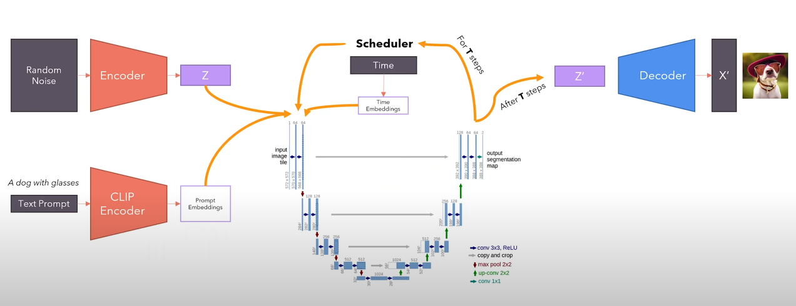
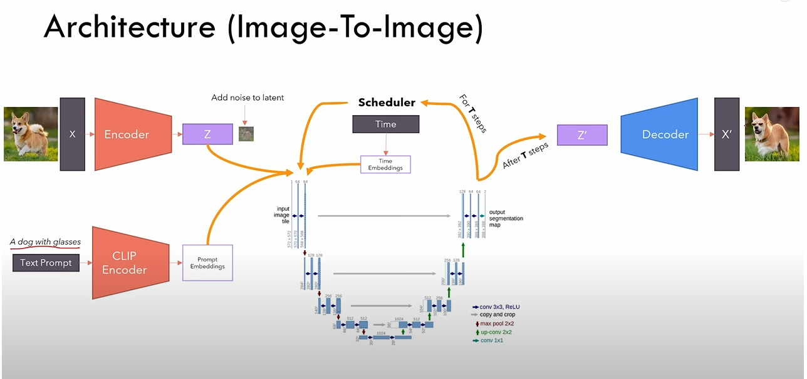
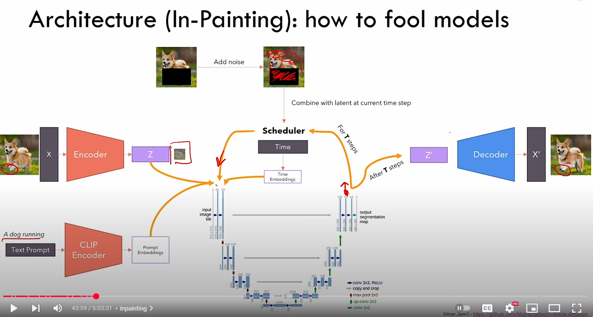
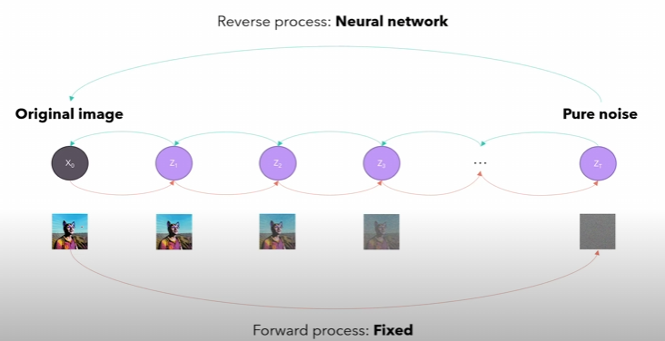
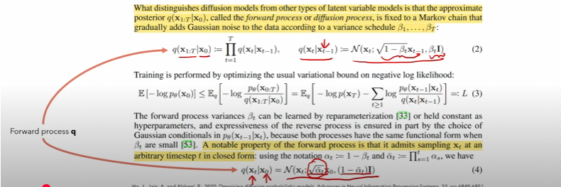
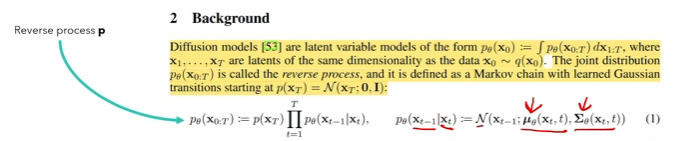

# StableDiffusion
Stable Diffusion

Text to image

Image to image

In-painting
(At each iteration, before sending response back to U-Net. We force U-Net to only train the blacked out area, and keep remaining area unaltered)

1. We enter a text prompt, which is encoded by CLIP
2. We pick a random noise, which is fed into an VAE, which outputs a latent distribution
3. Encoded text and Latent distribution of noise are fed into U-Net. The goal of U-Net is to determine `how much noise to remove to best follow the prompt`
4. Scheduler controls the loops and executions
5. After T steps, we convert Z' a latent distribution back to an image through VAE

* The more noise we add, the more freedom the model has to generate an image.

## Introduction
Stable diffusion is a generative model. It consists of two parts, one forward pass, and one reversed pass. 

The forward (diffusion) pass is simple and `fixed`, we apply the same encoding algorithm repeatedly, until the entire image is covered with pixels.

The reversed pass is complicated and must be achieved through neural network.

### The forward pass

### The reversed pass

#### How to condition the reverse process?
You may question how can the model generate something we want? How can the model understand our prompt?

- One method is to use joint distribution, we can train a model to learn a joint distribution `p(x,c)`. However, it is not practical as it requires the training of a model for each separate conditional signal.

- The other method is `classifier guidance`. It involves the training of a `separate model to condition the output`.

- The best method in this scenario is `classifier-free guidance`. We only train one network and during training, with some probability, we set the conditional signal to zero. This way the network becomes a mix of conditioned and unconditioned network. And we can take the conditioned and unconditioned output, and combine them with a weight that indicates how much we want the network to pay attention to the conditioned signal.

* output = w * (output_conditioned - output_unconditioned) + output_unconditioned
* w == how much attention we would like the model to give to prompt
